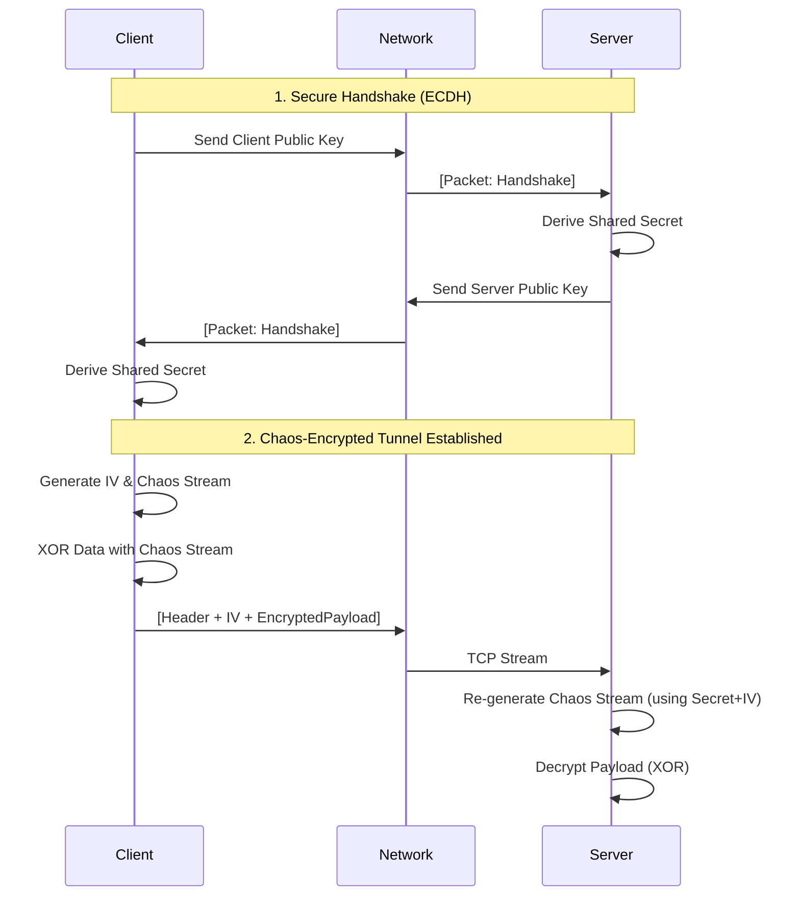

<div align="center">

# ⚡ AETHER
### Chaos-Encrypted High-Performance P2P Protocol
> **Secure. Zero-Allocation. Quantum-Ready Concepts.**

[](https://dotnet.microsoft.com/download/dotnet/10.0)
[](https://github.com/umitkrkmz/ChaoticEngine)
[](https://en.wikipedia.org/wiki/Elliptic-curve_Diffie%E2%80%93Hellman)
[](LICENSE)

<p align="center">
  <b>Aether</b> is an experimental, research-grade network protocol designed for <b>Secure Drone Swarms</b>, <b>IoT Grids</b>, and <b>Critical Infrastructure</b>.<br>
  It replaces traditional AES encryption with <b>Chaos Theory</b> (Lorenz/Sine Maps) accelerated by <b>AVX-512</b> intrinsics, ensuring microsecond-latency security.
</p>

</div>

---

## 🏗️ Architecture & Core Technology

Aether is built on a "Zero-Allocation" philosophy. It uses `System.IO.Pipelines` to process network streams without unnecessary memory copying, making it ideal for high-throughput scenarios.

### 🔒 Security Model: "The Hybrid Handshake"
Aether combines standard elliptic curve cryptography with chaos theory:

1.  **Authentication (Handshake):** Uses **ECDH (NIST P-256)** to establish a secure channel. No keys are ever transmitted over the network; only public parameters are exchanged.
2.  **Encryption (Transport):** Once the Shared Secret is derived, Aether switches to **Chaotic Stream Cipher** mode.
3.  **Chaos Seeding:** The chaotic map (e.g., Sine Map) is seeded using `HMAC-SHA256(SharedSecret + IV)`.



---

## 📦 Protocol Specification
Aether uses a custom binary protocol optimized for parsing speed.

| Offset    | Field         | Size   | Type      | Description                                     |
|-----------|---------------|--------|-----------|-------------------------------------------------|
| **0**     | **Magic**     | 4 B    | `uint`    | Protocol signature (`0x41455448` - "AETH")      |
| **4**     | **Type**      | 1 B    | `enum`    | Packet Type (`0x01`: Handshake, `0x02`: Data)   |
| **5**     | **Length**    | 4 B    | `int`     | Size of the Payload                             |
| **9**     | **IV**        | 16 B   | `byte[]`  | Initialization Vector (Salt for Chaos Engine)   |
| **25**    | **Payload**   | N      | `byte[]`  | ECDH Public Key or Encrypted Data               |


---

## 🚀 Getting Started

### Prerequisites
* **.NET 10 SDK** (LTS) or higher.
* CPU with AVX2 support (AVX-512 recommended for maximum chaos throughput).

### Installation
Aether depends on the custom **ChaoticEngine** library. For ease of use, the package and a configuration file are included in this repository.

1. Clone the repository:
```Bash
git clone https://github.com/umitkrkmz/Aether.git
cd Aether
```

2. Restore and Build: The included `nuget.config` will automatically locate the `ChaoticEngine` package in the `./LocalPackages` directory.

```bash
dotnet build -c Release
```

**Running the CLI**
Aether comes with a built-in CLI tool for testing the grid.

1. Start the Server (Listener)

```Bash
dotnet run --project src/Aether.CLI
# Select [S] in the menu
```

2. Start the Client (Sender) Open a new terminal:

```Bash
dotnet run --project src/Aether.CLI
# Select [C] in the menu
# Enter Server IP (Default: 127.0.0.1)
```


---


## 💻 Code Example
Using the Aether Networking API in your own projects:

```csharp
using Aether.Networking;

// --- SERVER SIDE ---
var server = new AetherServer(port: 5000);
await server.StartAsync(); // Starts listening and handling ECDH handshakes

// --- CLIENT SIDE ---
using var client = new AetherClient();
await client.ConnectAsync("127.0.0.1", 5000); 

// The client automatically performs the handshake on connect.
// Now we can send secure data:
byte[] secretPlans = File.ReadAllBytes("plans.topsecret");
await client.SendDataAsync(secretPlans); // Encrypted with Chaos Engine
```


---


## 🔮 Use Cases & Roadmap
This protocol is engineered for scenarios where standard SSL/TLS is too heavy or where "Moving Target Defense" (Chaos) is required.

- **Drone Swarm Communication:** Lightweight encryption for UAVs communicating in a mesh.

- **IoT Grids:** Secure command & control for embedded devices.

- **Steganography Transport:** Future versions will support embedding encrypted packets into image/audio streams.

## ⚠️ Disclaimer
**This is a research project.** While it implements standard ECDH for key exchange, the Chaos-based encryption is an experimental implementation demonstrating the performance capabilities of the **ChaoticEngine** library. It is not intended to replace TLS 1.3 in banking applications (yet).

<div align="center"> <sub>Designed & Engineered by <a href="https://www.google.com/search?q=https://github.com/umitkrkmz">Umit Korkmaz</a></sub> </div>